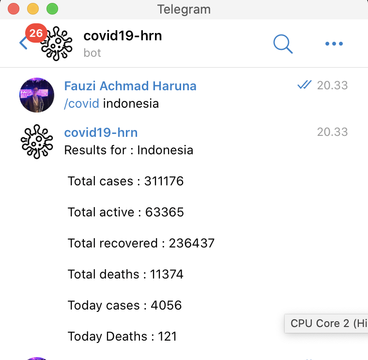

# BOT TELEVID19


Bot to inform covid19 statistic data from https://api.coronastatistics.live/countries/ 

## How to
Add bot [@covidhrn-bot](t.me/covidhrn_bot) from telegram, enter command /covid {country_name}. Example /covid usa
## Installation
When you want to make your bot, clone this repository. Add .env files for telegram token variable
```bash
TELEGRAM_TOKEN = " " (your telegram bot token from bot father)
```
Next you must install npm package using npm install

```bash
npm install
```
And run the server using 
```bash
node index.js
```


## License
Thanks for tutorial from https://dev.to/baronsindo/telegram-bot-made-easy-a-covid-19-statistics-bot-15fm

[MIT](https://choosealicense.com/licenses/mit/)